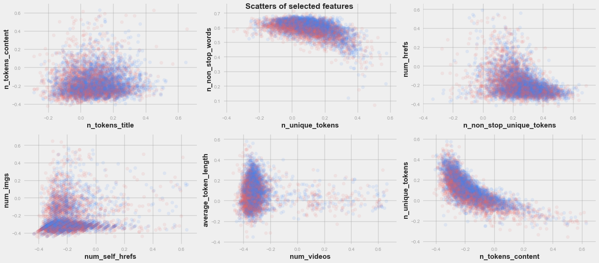
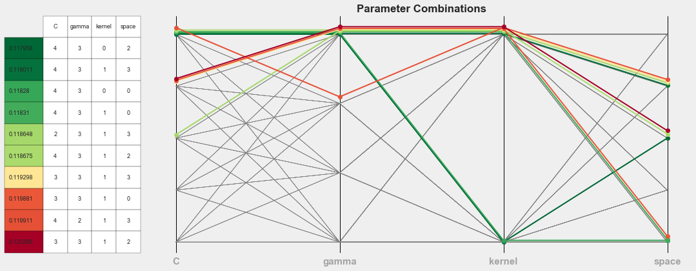
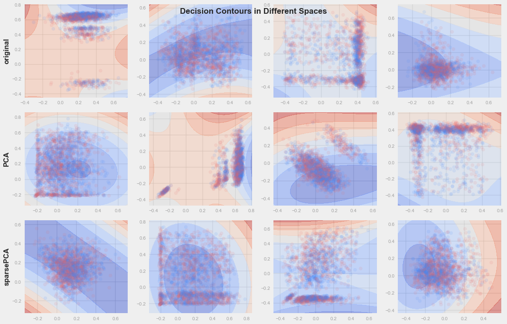
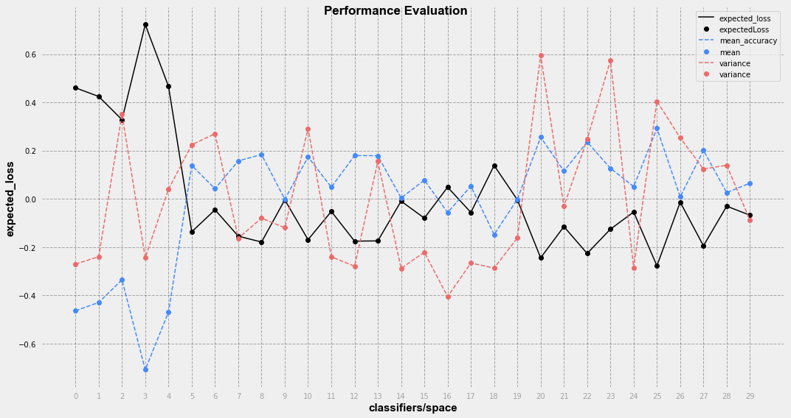
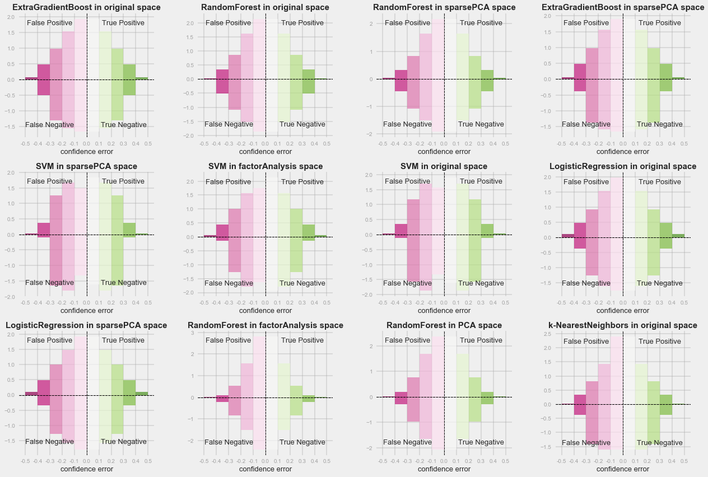

# Online News Popularity Classification

## Abstract:
Facilitated by the fast spreading and developing of internet and smart devices, how can we understand online news browsing data and find the pattern inside it become more and more important.

In this project I am using online news popularity data set containing 39644 news articles and 57 features about each article including statistical features like number of words in title, rate of non-stop words in the content, article publish weekdays etc. and NLP features like positive word rate, title subjectivity level etc. The goal is to classify whether these articles are popular or not quantified by article shares. 

## Synopsis:
The main motivation of this project is setting up a systematic framework to:

    1. Understand the dataset including noises and possible hidden features can be extracted. 
    2. Visualize the behaviors of different learning models and observe how they interact with this dataset.
    3. Compare the behavior and performance of those learning models.

To limit the size of Jupyter notebooks, I split this project into 2 parts: preprocessing and model fitting selection.

- **Preprocessing**

    1. Explore the statistical figures like mean, std, range, unique value/outlier counts and feature data types of dataset.
    
    2. Clean the dataset by merging related binary features, standard scale features, remove outliers etc.
    

    3. Using matrix decomposition methods to reduce dimensionality and  generate possibly more predictive feature spaces.
    
        1. original
        2. PCA
        3. sparsePCA
        4. FactorAnalysis
        5. NMF
    
    

- **Model fitting and selection**

    1. Fit different learning models on the cleaned dataset under different feature space and test different hyper-parameter combinations using grid searching. 
    
        1. Naive Bayes
        2. Logistic Regression
        3. SVM
        4. k-Nearest Neighbours
        5. Random Forest
        6. XGBoost

    2. Visualize the results of parameter tunning to observe how each of the parameters changed the model's behavior on this dataset.
    

    3. Visualize the decision boundaries to tell how classifiers adapt themselves on this dataset and identify possible problems.
    

    4. Evaluate and compare the performance of classifiers under different spaces using expected loss which considers both model flexibility and steadiness.
    

    5. Compare the prediction "confidence" of classifiers by plotting the confusion histogram. This allows us further examine the behavior of classifiers and identify possible problems.
    

## Files:
- **0_Preprocessing.ipynb**:   
    This Jupyter notebook contains code preprocesses the original dataset.

- **1_Model fitting and selection.ipynb**:   
    This Jupyter notebook contains code fits different learning models on cleaned dataset and compares the learning results.

- **modules/LearningPipe.py**:  
    This python code implements a wrapper class based on several sklearn models to perform feature selection, grid searching, cross validation and evaluation jobs. It also provides methods to visualize parameter tuning and decision boundaries. 

- **modules/Visual.py**:  
    This python code implements visualization class for basic plotting jobs. Both python files are imported as modules in the Jupyter notebooks.

## Dependencies:
Running the notebook requires following Python libraries installed:

    - sklearn  
    - numpy  
    - pandas  
    - xgboost  
    - matplotlib  
    - seaborn  

## API References:
- scikit-learn: Fabian Pedregosa, Gaël Varoquaux, Alexandre Gramfort, Vincent Michel, Bertrand Thirion, Olivier Grisel, Mathieu Blondel, Peter Prettenhofer, Ron Weiss, Vincent Dubourg, Jake Vanderplas, Alexandre Passos, David Cournapeau, Matthieu Brucher, Matthieu Perrot, Édouard Duchesnay. Scikit-learn: Machine Learning in Python, Journal of Machine Learning Research, 12, 2825-2830 (2011)

- Matplotlib: John D. Hunter. Matplotlib: A 2D Graphics Environment, Computing in Science & Engineering, 9, 90-95 (2007), DOI:10.1109/MCSE.2007.55

- Pandas: Wes McKinney. Data Structures for Statistical Computing in Python, Proceedings of the 9th Python in Science Conference, 51-56 (2010)

- NumPy & SciPy: Stéfan van der Walt, S. Chris Colbert and Gaël Varoquaux. The NumPy Array: A Structure for Efficient Numerical Computation, Computing in Science & Engineering, 13, 22-30 (2011), DOI:10.1109/MCSE.2011.37

- xgBoost: DMLC eXtra Gradient Boost Python Package, https://github.com/dmlc/xgboost

## License:
MIT License

Copyright (c) [2017] [Xian Lai]

Permission is hereby granted, free of charge, to any person obtaining a copy of this software and associated documentation files (the "Software"), to deal in the Software without restriction, including without limitation the rights
to use, copy, modify, merge, publish, distribute, sublicense, and/or sell copies of the Software, and to permit persons to whom the Software is
furnished to do so, subject to the following conditions:

The above copyright notice and this permission notice shall be included in all
copies or substantial portions of the Software.

THE SOFTWARE IS PROVIDED "AS IS", WITHOUT WARRANTY OF ANY KIND, EXPRESS OR
IMPLIED, INCLUDING BUT NOT LIMITED TO THE WARRANTIES OF MERCHANTABILITY,
FITNESS FOR A PARTICULAR PURPOSE AND NONINFRINGEMENT. IN NO EVENT SHALL THE
AUTHORS OR COPYRIGHT HOLDERS BE LIABLE FOR ANY CLAIM, DAMAGES OR OTHER
LIABILITY, WHETHER IN AN ACTION OF CONTRACT, TORT OR OTHERWISE, ARISING FROM,
OUT OF OR IN CONNECTION WITH THE SOFTWARE OR THE USE OR OTHER DEALINGS IN THE
SOFTWARE.

## Contact:
Xian Lai    
Data Analytics, CIS @ Fordham University    
XianLaaai@gmail.com     

